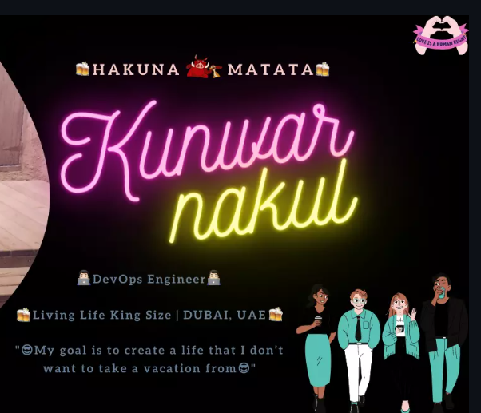
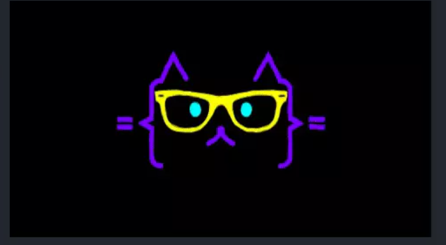

<div align="center">
  
</div>

<div align="center">

> [!TIP]
> *"Code is like humor. When you have to explain it, it’s bad."*
> 
> — **Cory House**

   
<br><br>

https://user-images.githubusercontent.com/31657420/190714127-119b3a9d-9946-4247-beef-6d3993be5d37.mp4

<br>


<br>


<br>

 <b>Passionate software developer focusing on Artificial Intelligence, Large Language Models, and modern web architectures. Experienced in building AI-assisted applications and scalable full-stack solutions.</b>

</div>

<br>

<br>

###  Tech Stack

<div align="center">
  
<a href="https://skillicons.dev">
  
</a>

<br><br>

  
</div>

<br>

<br>

###  GitHub Stats

<div align="center">

|_**GitHub Stats**_|_**GitHub Streak**_|
|-----------|-------------|
|||

<br>


</div>

<br>

<br>

###  About Me

**Hey!! Great to see you here!** 

```javascript
import { AI_Developer } from '@shivanshmax';

class Bio extends AI_Developer {
  name     = 'Shivansh Sahu';
  title    = 'B.Tech AI Student & Full-Stack AI Developer';
  location = 'Gwalior, India';
  email    = 'shivanshmax@gmail.com';
}

class Skills extends AI_Developer {
  learning = ['Cloud Architecture (AWS/Azure)', 'Advanced C++'];
  hobbies  = ['Prompt Engineering', 'LLM Integrations', 'Vibe Coding'];
  collab   = ['Open-source AI agents', 'Web prototypes'];
}
```

<br>

<br>

###  Let's Connect

*Find out more about me & feel free to connect with me here:*

<br>

<div align="center">

[](mailto:shivanshmax@gmail.com) [](https://www.linkedin.com/in/shivansh-sahu-ai) [](https://github.com/shivanshmax-Monster)

</div>

<br>

<div align="center">

<i>⚡ I've built tools for everything from prep tracking to automated MCQ generation!</i>

<br><br>


</div>


---


<h1 align="center">💠 ようこそ 👋, 𝘐'𝘮 𝘑𝘰𝘴𝘩! 💠</h1>
<div align="center">
  
</div>

<br>

<h1 align="center">𝗔𝗕𝗢𝗨𝗧 𝗠𝗘</h1>

<ul>
  <li> 📺 Currently watching <b>86 Eighty Six</b></li>
  <li> 🔭 I’m currently working on <b>Intune deployment for clients</b></li>
  <li> 🎮 I’m currently playing <b>Genshin Impact</b> or <b>Battlefield V</b></li>
  <li> 🤔 I’m looking for help with <b>becoming a Microsoft MVP</b></li>
  <li> 📫 How to reach me: <b>0go1fbn9c@relay.firefox.com</b></li>
</ul>

<div align="center">
    <h1 align="center">𝗟𝗜𝗦𝗧𝗘𝗡𝗜𝗡𝗚 𝗧𝗢</h1>
    <a href="https://open.spotify.com/user/1ecl2g5fu3hgbdnees4dt53ct"></a>
</div>

<br>

<div>
<h1 align="center">𝗞𝗡𝗢𝗪𝗟𝗘𝗗𝗚𝗘</h1>
</div>
<div align="center">
  <p align = "center">An entry-level Microsoft adminstrator in college watching out for clients with my experience in MS/O365 cloud apps and endpoint management via Intune.<br></p>
  <p align = "center">
      
      
      
      
      
      
      
      
      
    
      
      
      
    
  </p>
  
</div>

<br>

<h1 align="center">𝗦𝗧𝗔𝗧𝗦</h1>
<div align="center">
  <a href="https://github.com/anuraghazra/github-readme-stats"></a> 
</div>
<div align="center">
  <a href="https://github.com/anuraghazra/github-readme-stats"></a>
</div>

<br>

<h1 align="center">𝗦𝗢𝗖𝗜𝗔𝗟𝗦</h1>
<div align="center">
  <a href="https://www.linkedin.com/in/j0shbl0ck247/">
  
  </a>
  <a href="https://github.com/j0shbl0ck">
  
  </a>
  <a href="https://discord.gg/Hatman77#8963" >
  
  </a>
  <br>
  
</div>

<h1 align="center"></h1>

[](https://holopin.io/@j0shbl0ck)

              


<br>
<br>
<div align="center">
  
</div>
<br>
<h2 align="center">Thank you for reading 👋 </h2>
<br>
<h1 align="center">Support Me 🎧 🎤</h1>
<p align="center">
  
  <br>
  
</p>
